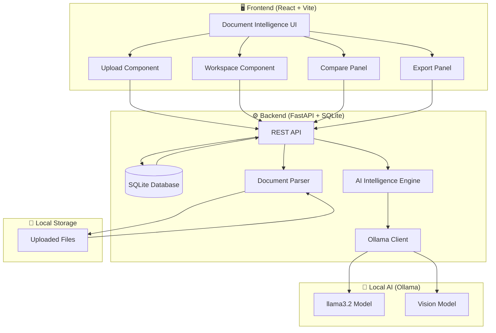
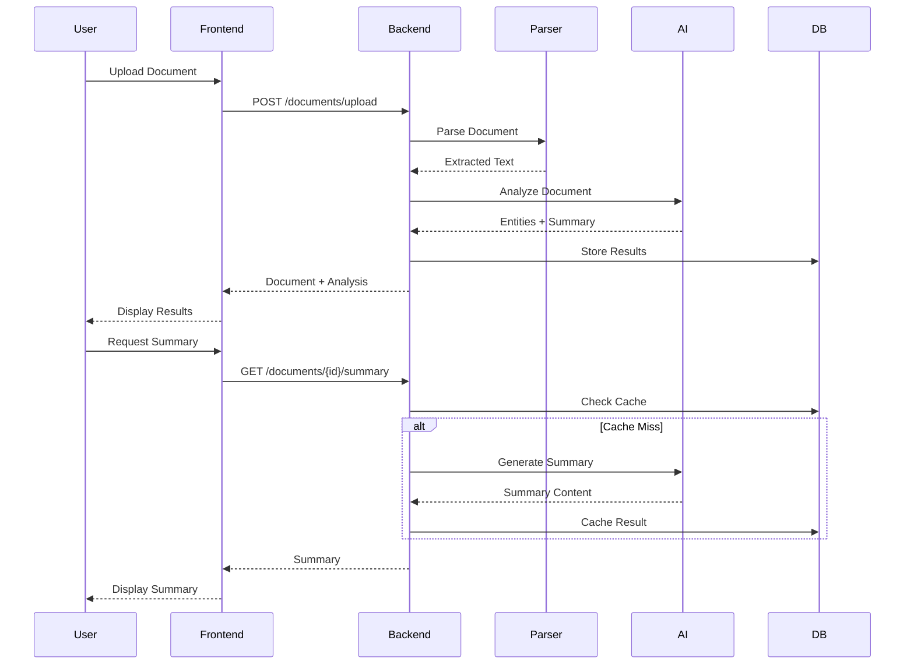
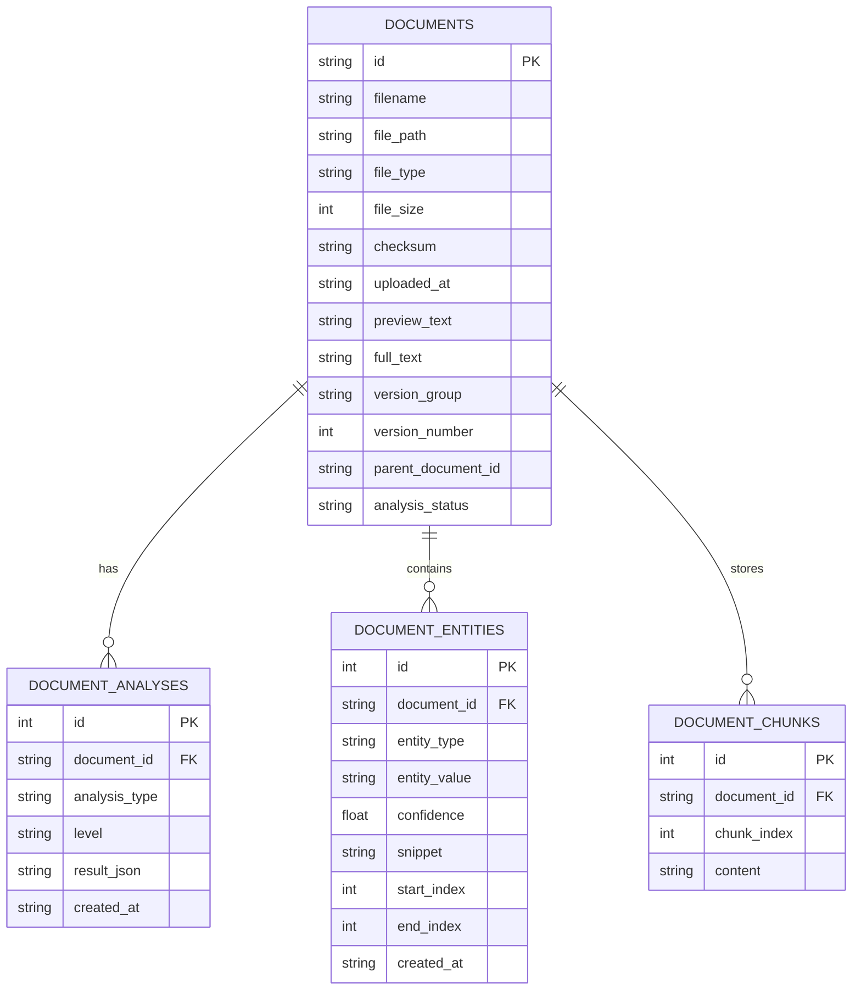

# Smart Document Intelligence Platform

A privacy-first, local-only document intelligence platform that transforms documents into actionable business insights using local AI (Ollama). No external APIs or cloud services required.

## 📊 Architecture



## 🔄 Data Flow



## 🗄️ Database Schema



## ✨ Features

- Upload `PDF`, `DOCX`, `TXT`, `PNG`, `JPG` files (drag/drop or picker)
- Automatic document analysis and entity extraction
- Summary generation (`brief`, `detailed`, `bullets`)
- Document version comparison (similarity percentage shown in UI)
- Export extracted data as `JSON`, `CSV`, or markdown report
- Remove documents (deletes file + related local records)

## Removed From Scope

These modules were intentionally removed from the project:
- Document Chat
- Conversations
- Template Extraction
- Automated Workflows
- Notifications
- Multi-Document Chat

## Project Structure

```text
pythonchatbott-main/
├── backend/
│   ├── app.py
│   ├── config.py
│   ├── database.py
│   ├── services/
│   │   ├── document_parser.py
│   │   ├── intelligence.py
│   │   └── ollama_client.py
│   └── data/
│       ├── document_intel.db
│       └── uploads/
└── frontend/
    └── src/
        ├── App.jsx
        ├── App.css
        └── services/apiService.js
```

## API Endpoints

- `GET /health`
- `GET /dashboard`
- `POST /documents/upload`
- `POST /upload` (legacy compatibility)
- `GET /documents`
- `DELETE /documents/{document_id}`
- `GET /documents/{document_id}`
- `GET /documents/{document_id}/file`
- `GET /documents/{document_id}/summary?level=brief|detailed|bullets`
- `POST /documents/{document_id}/analyze`
- `GET /documents/{document_id}/versions`
- `POST /compare`
- `POST /export`

## Run Locally

### 1) Backend

```bash
cd /Users/vabhiram/Downloads/pythonchatbott-main
python3 -m venv .venv
source .venv/bin/activate
pip install -r requirements.txt
uvicorn backend.app:app --reload
```

Backend URL: `http://127.0.0.1:8000`

### 2) Ollama

Pull model:

```bash
ollama pull llama3.2:3b
```

Optional env vars:

```bash
export OLLAMA_BASE_URL=http://127.0.0.1:11434
export OLLAMA_MODEL=llama3.2:3b
export OLLAMA_VISION_MODEL=llama3.2-vision
```

### 3) Frontend

```bash
cd /Users/vabhiram/Downloads/pythonchatbott-main/frontend
npm install
npm run dev
```

Frontend URL: `http://127.0.0.1:5173`

Optional frontend env:

```bash
VITE_API_BASE=http://127.0.0.1:8000
```

## UI Notes (Current)

- Sidebar: upload + document library + remove action
- Main area: summary/extraction workspace
- Compare panel: similarity percentage
- Export panel: JSON/CSV/Report + manual download trigger
- No auto-download for document preview endpoint (`/documents/{id}/file` serves inline)

## Privacy

- Files are stored locally in `backend/data/uploads`
- Metadata, analyses, and entities are stored in local SQLite (`backend/data/document_intel.db`)
- AI inference is performed through local Ollama endpoint

## Run With Docker Compose

This setup runs:
- `web` (Nginx + built React frontend) on `http://localhost:8080`
- `backend` (FastAPI) on internal Docker network
- `ollama` for local LLM inference

### 1) Build and start containers

```bash
docker compose build
docker compose up -d
```

### 2) Pull the Ollama model (first run)

```bash
docker compose exec ollama ollama pull llama3.2:3b
docker compose restart backend
```

### 3) Open the app

- UI: `http://localhost:8080`
- API health: `http://localhost:8080/api/health`

### Notes

- Uploaded files and SQLite DB are stored in Docker volume `backend_data`.
- Ollama models are stored in Docker volume `ollama_data`.
- To use a different model, set `OLLAMA_MODEL` in your shell before `docker compose up`.

## Troubleshooting

- `Error: listen tcp 127.0.0.1:11434: bind: address already in use`
  - Ollama is already running. Do not start a second `ollama serve`.
- `MLX: Failed to load symbol: mlx_metal_device_info`
  - Usually non-blocking if model pull/inference still works.
- Frontend still showing old UI
  - Restart `npm run dev` and hard refresh browser.

## Validation Commands

```bash
# backend syntax check
python3 -m compileall backend

# frontend production build
cd frontend && npm run build
```
